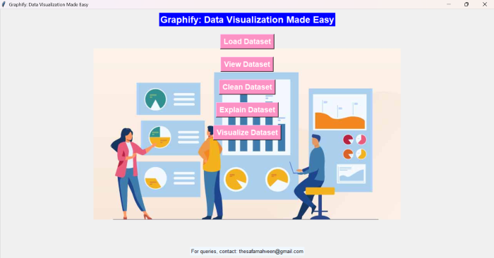

# Graphify
**Graphify: Data Visualization Made Easy** is a tool that simplifies data visualization with Python's Tkinter, Pandas, Matplotlib, and Seaborn. Users can load, view, clean, and visualize datasets using various plot types, including bar, line, scatter, box plots, and heatmaps, all through an intuitive interface.
<br>
Author - Safa Mahveen

## Overview

## Features
- **Load Datasets**: Users can import CSV files for analysis.
- **View Data**: Users can preview the dataset in a structured table format.
- **Data Cleaning**: Users can drop rows with missing values or fill them with mean/median.
- **Dataset Explanation**: Users can get insights into the dataset's shape, data types, and missing values.
- **Visualizations**: Users can create various plot types, including:
  - Bar Plots
  - Line Plots
  - Scatter Plots
  - Box Plots
  - Heatmaps
- **Intuitive Interface**: Easy navigation through a simple Graphical User Interface.

## Requirements

- Python 3.x
- Tkinter
- Pandas
- Matplotlib
- Seaborn
- Pillow

## Installation

1. Clone the repository:
   ```bash
   git clone https://github.com/SafaMahveen/Graphify.git
   ```
2. Navigate to the project directory:
   ```bash
   cd graphify
   ```
3. Install the required packages:
   ```bash
   pip install pandas matplotlib seaborn PIL
   ```

## Usage

Run the application using:

```bash
python graphify.py
```

Once the application is running, you can load a dataset and start visualizing your data!

### Functional Overview

- **Load Dataset**: Click the "Load Dataset" button to select a CSV file.
- **View Dataset**: Preview the loaded dataset in a new window.
- **Clean Dataset**: Remove or fill missing values with the mean or median.
- **Explain Dataset**: Get an overview of the dataset's structure and missing values.
- **Visualize Dataset**: Select plot types and axes to create visualizations.

## Contributing

Contributions are welcome! If you have suggestions for improvements or new features, please open an issue or submit a pull request.


## Acknowledgements

- [Tkinter Documentation](https://docs.python.org/3/library/tkinter.html)
- [Pandas Documentation](https://pandas.pydata.org/docs/)
- [Matplotlib Documentation](https://matplotlib.org/stable/contents.html)
- [Seaborn Documentation](https://seaborn.pydata.org/)
```